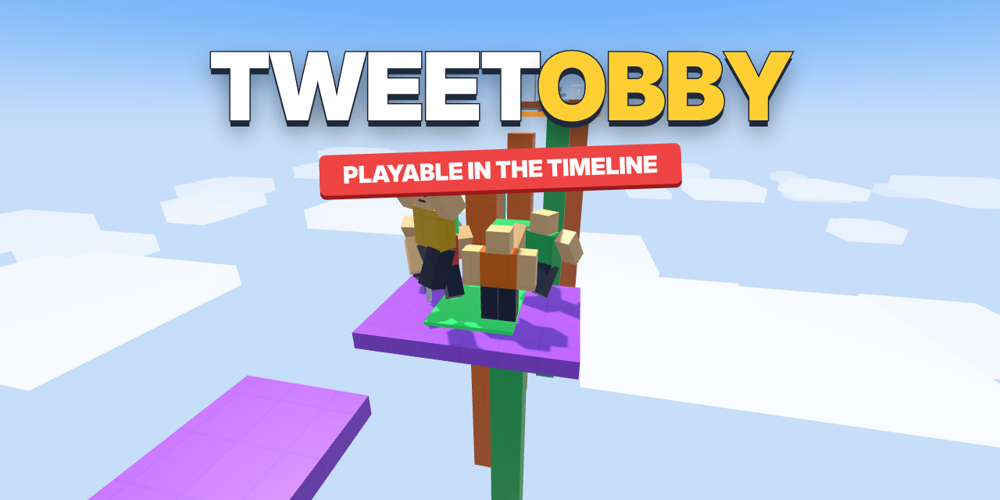
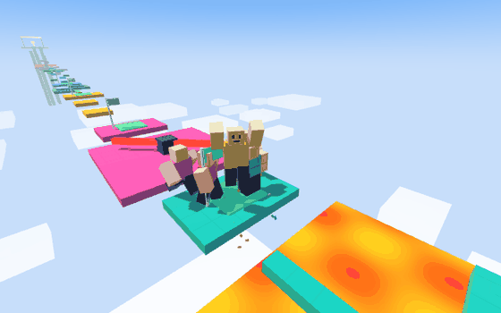
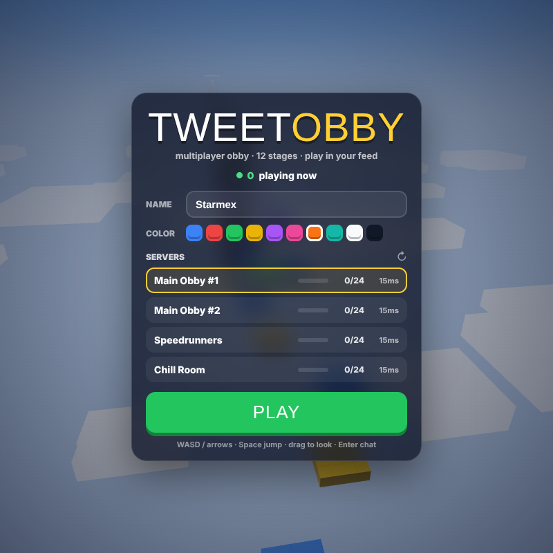
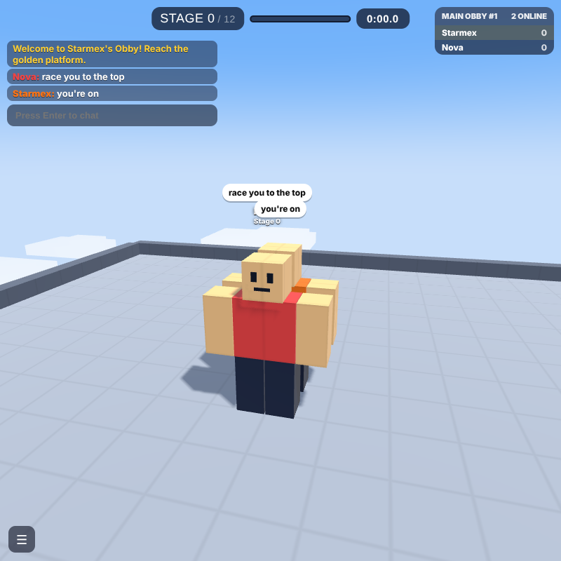
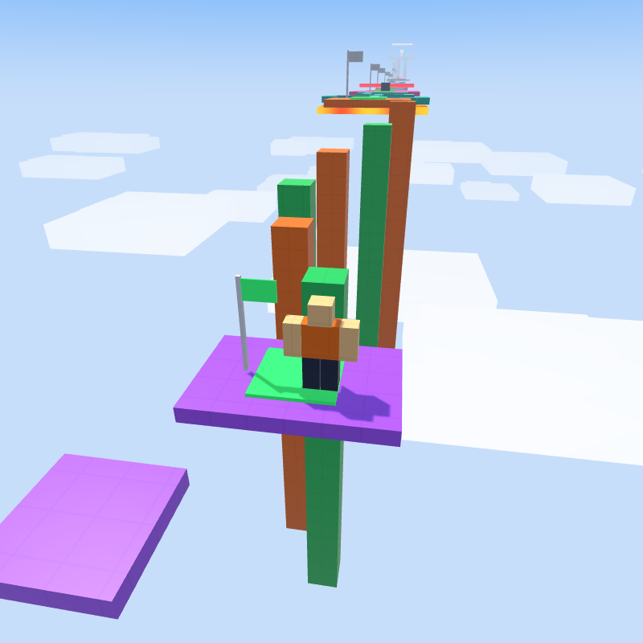
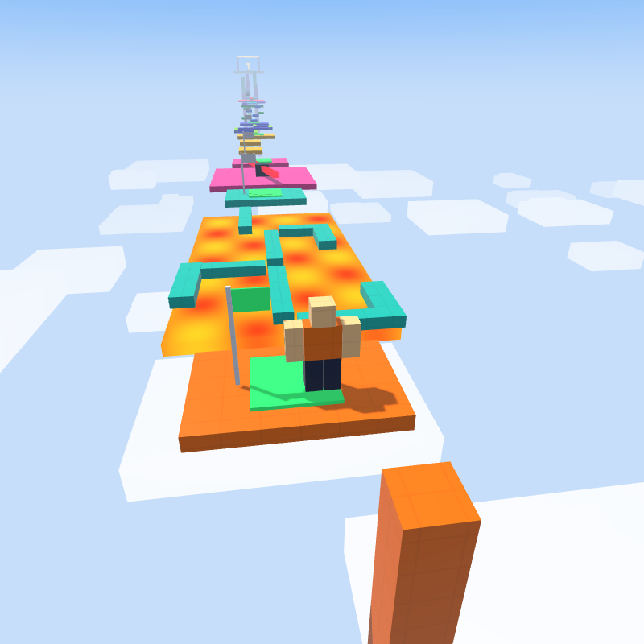
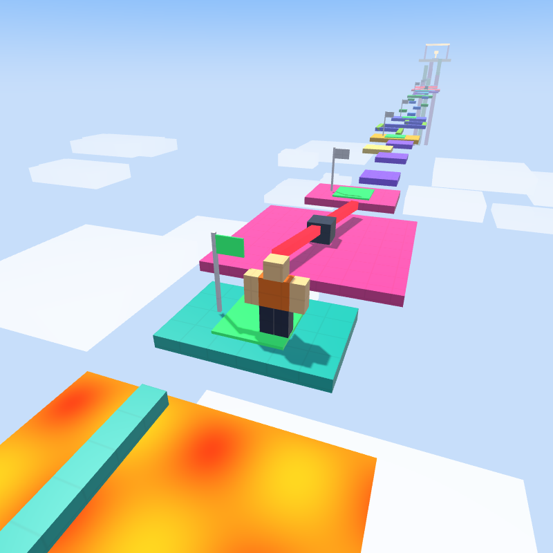
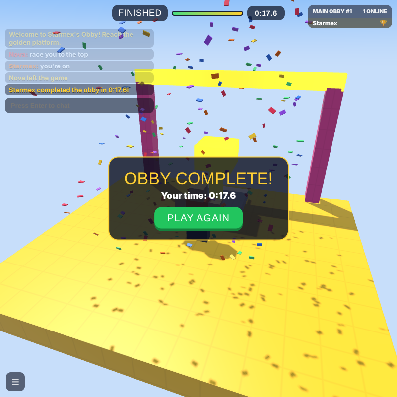
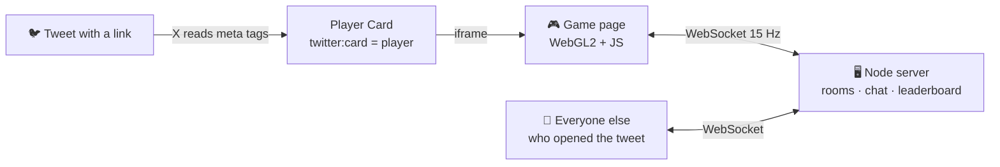

<div align="center">



### A multiplayer 3D obby that runs *inside a tweet*

Open the post, hit play, and you're jumping lava with everyone else who opened it.<br>
No download. No app. No game engine. Built end-to-end by **Claude Opus 5.5** in ~20 minutes.

<br>

<a href="https://roblox-production-e3f6.up.railway.app/embed"></a>
<a href="https://x.com/starmexxx"></a>


<br><br>



</div>

---

## ✨ What's inside

<table>
<tr>
<td width="50%" valign="top">

**🎮 A real game, not a demo**
- 12 stages: jumps, moving platforms, lava, spinners, vanishing blocks, a final tower
- Checkpoints, deaths that blow your avatar into pieces, confetti, a timer
- Third-person camera, drag to look, mobile joystick + jump button

</td>
<td width="50%" valign="top">

**🌐 Live multiplayer**
- 4 servers × 24 players with a real-time player count
- See everyone run, jump and fall - smoothed at 15 Hz
- Chat with speech bubbles, live leaderboard by stage, "X completed the obby in 0:47" broadcasts

</td>
</tr>
<tr>
<td valign="top">

**⚡ Zero dependencies**
- Hand-written WebGL2 renderer: instancing, shadow maps, sky, fog
- Hand-written WebSocket server (RFC 6455) on plain Node `http`
- `npm install` installs nothing. It just runs.

</td>
<td valign="top">

**🐦 Lives in the timeline**
- Uses X's **Player Card** - the tweet embeds the game as an iframe
- Custom card title, description and preview image
- Same link works in any browser, on any device

</td>
</tr>
</table>

## 📸 Screenshots

<table>
<tr>
<td><p align="center"><sub><b>Launch menu</b> - name, color, live servers</sub></p></td>
<td><p align="center"><sub><b>Multiplayer</b> - chat bubbles + leaderboard</sub></p></td>
<td><p align="center"><sub><b>Stage 3</b> - pillar climb</sub></p></td>
</tr>
<tr>
<td><p align="center"><sub><b>Stage 4</b> - the floor is lava</sub></p></td>
<td><p align="center"><sub><b>Stage 5</b> - the spinner</sub></p></td>
<td><p align="center"><sub><b>Finish</b> - obby complete</sub></p></td>
</tr>
</table>

## 🧠 How a game fits inside a tweet



The whole trick is five meta tags in [`index.html`](blockrun/public/index.html):

```html
<meta name="twitter:card"   content="player">
<meta name="twitter:title"  content="Join &quot;Starmex's Obby&quot;">
<meta name="twitter:image"  content="https://your-domain/og.png">
<meta name="twitter:player" content="https://your-domain/embed">
<meta name="twitter:player:width" content="800">
```

X sees `player`, shows a ▶ button, and loads your page in an iframe right in the feed. Everything else is just a good game.

## 🚀 Make your own in 5 minutes

**1. Run it locally**
```bash
git clone https://github.com/STARMEXXX/ROBLOX.git
cd ROBLOX/blockrun
npm start            # -> http://localhost:3000
```

**2. Deploy** (needs websockets - Railway, Render, Fly.io work; Vercel doesn't)
1. Fork this repo → [railway.app](https://railway.app) → **New Project** → **Deploy from GitHub**
2. Service **Settings** → **Root Directory** = `blockrun`
3. **Networking** → **Generate Domain** (port `8080`)

**3. Post it**
- Change the card title in `blockrun/public/index.html` and the image `og.png`
- Tweet the link: `https://your-domain/embed`
- If X shows an old preview, it's cached - add `?2` to the link

## 🕹️ Controls

| | Desktop | Mobile |
|---|---|---|
| Move | `W A S D` / arrows | left joystick |
| Jump | `Space` | ⤒ button |
| Camera | drag mouse, scroll to zoom | drag screen |
| Chat | `Enter` | tap the chat box |
| Respawn | `R` | - |

## 📁 Project

```
blockrun/
├── server.js          # http + websocket server, 4 rooms × 24 players, /api/servers
├── package.json       # zero dependencies
└── public/
    ├── index.html     # Player Card meta tags, menu, HUD
    ├── game.js        # WebGL2 engine, physics, 12-stage obby, netcode
    ├── style.css      # UI
    └── og.png         # card preview image
```

<div align="center">

<br>

**Built with [Claude Opus 5.5](https://www.anthropic.com/claude) · made by [@starmexxx](https://x.com/starmexxx)**

<sub>Fan project. Not affiliated with Roblox Corporation or X Corp.</sub>

⭐ **Star it if it made you jump** ⭐

</div>
